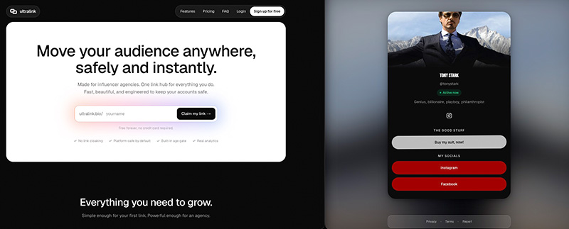

# 🔗 Ultralink

[](https://github.com/lvfranek/Ultralink/actions/workflows/ci.yml)

Ultralink is a website builder for creators and agencies —
build a fast, branded link page and see real analytics behind every click.



## ⌨️ Tech Stack

| Area        | Choice                                                        |
| ----------- | ------------------------------------------------------------- |
| Framework   | Next.js 16 (App Router)                                       |
| UI          | React 19 + React Compiler                                     |
| Language    | TypeScript                                                    |
| Styling     | Tailwind CSS v4                                               |
| Database    | [Supabase](https://supabase.com) — Postgres, auth, storage    |
| Payments    | [Stripe](https://stripe.com) — subscriptions + webhooks       |
| Email       | [Resend](https://resend.com)                                  |
| Drag & drop | [dnd-kit](https://dndkit.com) — link reordering               |
| Charts      | [Recharts](https://recharts.org) — analytics dashboard        |
| Icons       | Lucide                                                        |
| Hosting     | Vercel                                                        |

## 🚀 Features

**On your page**
- **Unlimited links** — create as many link pages as your plan allows.
- **Simple or advanced** — easy for your first link, complex when you need it.
- **Conversion-ready designs** — pages tuned to convert, or styled to match your brand.
- **Quick pages** — pages load instantly, even on slow connections.
- **Deep linking** — your links open in the real browser, not a broken in-app one.

**Growth & control**
- **Real analytics** — clicks, CTR, countries, devices, time on page, and top links.
- **Win-Back** — offer leaving visitors a second link before they go.
- **Country blocking** — restrict your page to specific countries.
- **18+ age gate** — a clean, compliant age screen for mature content.
- **Active badge 🟢** — show a live "active now" badge to build trust.
- **Team access** — let your assistant create links and track data for you.

**In the dashboard**
- Link page builder with live preview (profile, links, socials, design, advanced tabs)
- Analytics with a date-range picker
- Revenue tracking and account/billing settings
- Admin panel for the site owner — see [Admin Panel](#%EF%B8%8F-admin-panel)

## 🎞️ Live Demo

[ultralink.bio](https://ultralink.bio)

## 🚦 Getting Started

**Prerequisites:** Node.js 20+, a Supabase project, and Stripe/Resend accounts (test mode is fine).

1. **Clone and install**
   ```bash
   git clone https://github.com/lvfranek/Ultralink.git
   cd Ultralink
   npm install
   ```

2. **Set up the database.** In your Supabase project's SQL editor, run every file in
   [`supabase/migrations/`](supabase/migrations/) in filename order, then create a **public** bucket
   named `media` under Storage and run [`supabase/storage-policies.sql`](supabase/storage-policies.sql).

3. **Configure your environment**
   ```bash
   cp .env.example .env.local
   ```
   Fill in the values — see [Environment](#-environment) below. `.env.example` documents where to
   find each one.

4. **Start the dev server**
   ```bash
   npm run dev
   ```
   Open [http://localhost:3000](http://localhost:3000).

5. *(Optional)* **Forward Stripe webhooks locally** so subscription changes reach the app:
   ```bash
   stripe listen --forward-to localhost:3000/api/stripe/webhook
   ```

## 🔑 Environment

All variables are documented inline in [`.env.example`](.env.example). The groups are:

| Group | Variables | Notes |
| ----- | --------- | ----- |
| Supabase | `NEXT_PUBLIC_SUPABASE_URL`, `NEXT_PUBLIC_SUPABASE_ANON_KEY`, `SUPABASE_SERVICE_ROLE_KEY` | The service role key must never reach the browser. |
| Site URL | `NEXT_PUBLIC_SITE_URL` | Single source of truth for absolute URLs (Stripe redirects, sign-out, invite emails). **Must be set at build time** — it's inlined into the bundle. |
| Email | `RESEND_API_KEY` | Needs "Sending" permission and a verified sending domain. |
| Stripe | `NEXT_PUBLIC_STRIPE_PUBLISHABLE_KEY`, `STRIPE_SECRET_KEY`, `STRIPE_WEBHOOK_SECRET` | Use `pk_test_` / `sk_test_` keys in development. |
| Stripe prices | `STRIPE_PRICE_<TIER>_MONTHLY` / `_ANNUAL` | One pair per tier (1, 3, 10, 25, 50, 100, 200, 400 link pages). Each price needs metadata `{ tier, interval }`. Annual is billed yearly at roughly a 25% discount. |
| Admin | `DISCORD_WEBHOOK_URL`, `DISCORD_BUGS_WEBHOOK_URL`, `DISCORD_FEATURES_WEBHOOK_URL`, `ADMIN_USER_ID` | All optional. Discord notifications silently no-op when unset, so signup and payment flows never fail. `/admin` 404s for everyone but `ADMIN_USER_ID`. |

Never commit `.env.local`.

## 🛡️ Admin Panel

A private business overview at **`/admin`**, for the site owner only.

**Access.** Only the account whose user ID matches `ADMIN_USER_ID` can open it. Everyone else —
including signed-out visitors — gets a regular 404, so the page's existence isn't revealed. It isn't
linked in the sidebar; open `/admin` directly. Find your user ID in Supabase under
**Authentication → Users**.

**What it shows**
- **Key numbers** — total users, Pro users (with conversion rate), free users, MRR with estimated
  ARR, and subscription health (accounts in the payment grace period and canceled accounts).
- **Tier distribution** — for each plan tier: monthly vs. annual customers, total, and MRR.
- **Recent signups** — the last 7 days, with each user's plan.

The admin account is excluded from revenue and conversion numbers, so giving yourself Pro doesn't
inflate MRR.

**Discord notifications** complement the panel (all optional, see [Environment](#-environment)):
new signups (email or Google), new Pro subscriptions with updated MRR, cancellations, and bug
reports / feature requests from the in-app feedback form.

## 📁 Project Structure

```
src/
  app/
    (marketing)/          Landing page, help center, privacy, terms
    (auth)/               Login, auth callback + email confirm
    (dashboard)/
      dashboard/          Links, analytics, revenue, account (+ domains placeholder)
      admin/              Admin-only overview (gated by ADMIN_USER_ID)
    [slug]/               Public link pages (+ blocked state)
    r/[link_id]/          Click-tracking redirect route
    checkout/             Stripe Checkout entry point
    invite/accept/        Team invite acceptance
    actions/              Server actions (links, pages, billing, team, analytics, …)
    api/
      stripe/webhook/     Stripe subscription webhook handler
      track/winback/      Win-Back interaction tracking
      account/delete/     Account deletion
      auth/signout/
  components/
    marketing/            Hero, features, pricing, FAQ, help center
    dashboard/            Shell, sidebar, modals, page-builder/
    public/               Public page view, age gate, win-back overlay, social icons
    ui/
  lib/
    supabase/             Browser, server, and service-role clients + types
    stripe/               Stripe server client + price/tier mapping
    analytics/            Analytics helpers
    notifications/        Discord webhooks
supabase/
  migrations/             Schema migrations (run in filename order)
  storage-policies.sql    Policies for the public `media` bucket
```

## ☁️ Deployment

The reference deployment runs on [Vercel](https://vercel.com), connected to this GitHub repo.

1. Import the repository into Vercel.
2. Add every variable from `.env.example` under **Project Settings → Environment Variables**. Set
   `NEXT_PUBLIC_SITE_URL` to your production URL *before* the first build — it's inlined at build
   time, not read at runtime.
3. Create a Stripe webhook pointing at `https://<your-domain>/api/stripe/webhook`, subscribed to:
   - `checkout.session.completed`
   - `customer.subscription.created`
   - `customer.subscription.updated`
   - `customer.subscription.deleted`
   - `invoice.payment_failed`
   - `invoice.payment_succeeded`

   Copy its signing secret into `STRIPE_WEBHOOK_SECRET`.
4. Deploy. Pushes to the default branch redeploy automatically.

## 📜 Available Scripts

| Command         | What it does                        |
| --------------- | ----------------------------------- |
| `npm run dev`   | Start the Next.js dev server        |
| `npm run build` | Production build                    |
| `npm run start` | Serve the production build          |
| `npm run lint`  | Run ESLint over the project         |
| `npm test`      | Run the unit tests once (Vitest)    |
| `npm run test:watch` | Re-run tests on every file change |

## 📚 Additional Resources

- [Next.js documentation](https://nextjs.org/docs)
- [Supabase documentation](https://supabase.com/docs)
- [Stripe documentation](https://docs.stripe.com)
- [Resend documentation](https://resend.com/docs)
